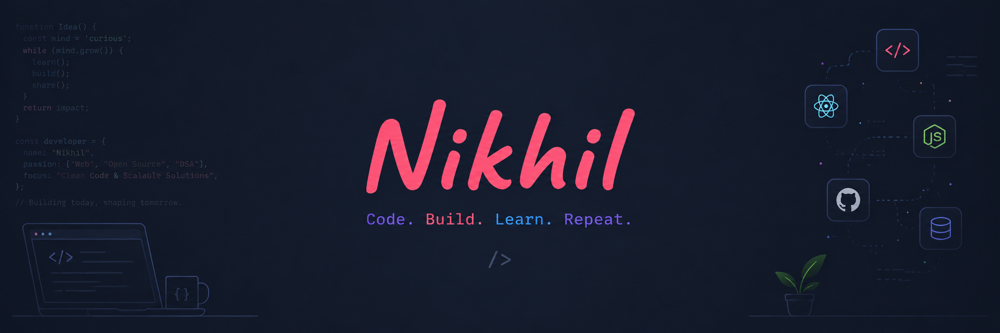

 

I'm a self-taught passionate FrontEnd developer from India 🇮🇳

**About me**

- 💼 Student

- 📈 Love building everything from scratch, clean logic, no shortcuts, and zero template bloat

- ❤️ I love React, TypeScript, and building fun experiments on type-level

- 💬 Ask me about anything [here](https://github.com/yadavnikhil03/yadavnikhil03/issues)

<code></code>
<code></code>
<code></code>
<code></code>

|  |  |
| ------------- | ------------- |

#### Top Repositories

 
 

