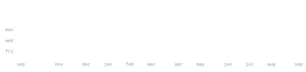

[github](https://github.com/yadavnikhil03) &nbsp;·&nbsp;
[twitter](#) &nbsp;·&nbsp;
[linkedin](#) &nbsp;·&nbsp;
[email](mailto:nikhil181245@gmail.com)

> CA Student, exploring the limits of code and creativity. 
> I build fast, learn fast, and focus on practical solutions.

I'm currently focused on building robust web applications and experimenting 
with automation and AI. Always looking for the next challenging problem to solve.

<samp>python &nbsp; javascript &nbsp; typescript &nbsp; react &nbsp; node.js &nbsp; docker &nbsp; git &nbsp; linux</samp>

**[Play-integrity-fix-guide](https://github.com/yadavnikhil03/Play-integrity-fix-guide)** &nbsp;·&nbsp; <samp>guide, magisk</samp> 
Easiest Way to Fix Strong Integrity on Custom ROMs & Rooted Devices

**[GameUnlocker](https://github.com/yadavnikhil03/GameUnlocker)** &nbsp;·&nbsp; <samp>C++</samp> 
A Magisk/KSU module that unlocks 90 FPS and higher in BGMI, PUBG, and other games, delivering smoother gameplay even on low-end devices.

**[SwapBoost-Pro](https://github.com/yadavnikhil03/SwapBoost-Pro)** &nbsp;·&nbsp; <samp>Shell</samp> 
A magisk module that optimizes your device's memory performance through persistent zRAM + Swapfile optimization with VM tweaks.

Every graphic here is generated, not embedded from anyone else's server. 
`ascii.svg` is an animated typing portrait. The stat graphics and section headings are drawn by [a scheduled action](.github/workflows/refresh.yml) 
straight from the GitHub GraphQL API, once a day, committing only what changed.

They animate with SMIL inside the SVG, because GitHub strips scripts from 
READMEs — and since nothing loads from a third party, nothing here can 
rate-limit or go dark.
